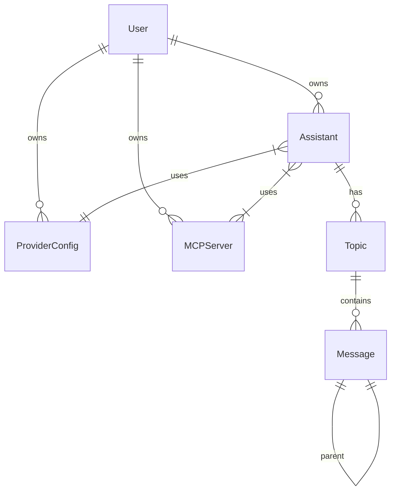

# Design: Core Architecture

## Database Schema (Prisma)
The application relies on a strictly decoupled relational model.

### Key Entities
1.  **ProviderConfig**: Stores credentials (API Keys) and endpoints. Decoupled from Assistants.
2.  **MCPServer**: Stores endpoints for Remote SSE MCP servers.
3.  **Assistant**: The composition entity that binds a `ProviderConfig`, a `ModelId`, `SystemPrompt`, and multiple `MCPServers`.
4.  **Topic/Message**: The chat history. Messages are a **Tree**, not a List. Each message points to a `parentId`.

### Relationship Diagram

## MCP Runtime (Client-to-Server)
The Next.js backend acts as the **MCP Client**.
1.  **Discovery**: On chat start, fetch `tools` from all associated `MCPServer` SSE endpoints.
2.  **Execution**:
    - LLM calls a tool.
    - Server sends JSON-RPC request to the specific MCP Server via HTTP Post.
    - Result is fed back to LLM.

## Chat Tree Data Structure
Instead of a linear array `[User, AI, User, AI]`, we store a Tree.
- `Message` table has `parentId`.
- **Traversal**: To build the Context Window for the LLM, we traverse from the current leaf node upwards to the root, then reverse the list.
- **Branching**: Editing a message creates a *sibling* node, starting a new branch.
