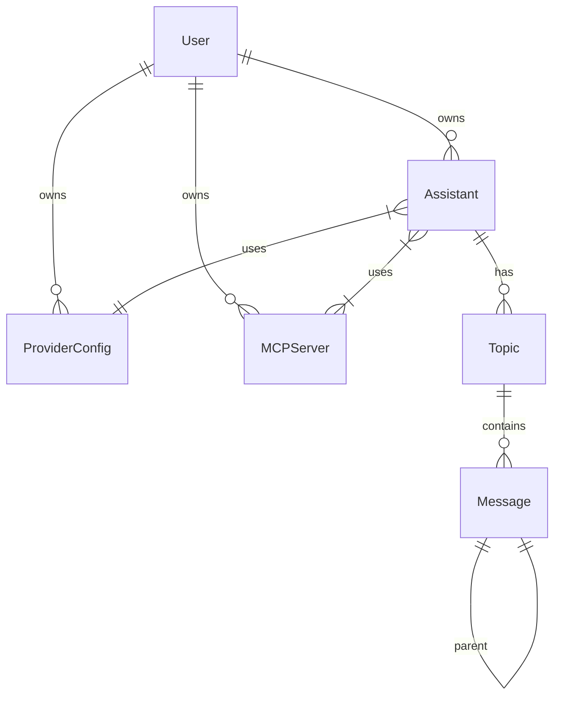

# Design: Core Architecture

## Database Schema (Prisma)
该应用程序依赖于一个严格解耦的关系模型。

### Key Entities
1.  **ProviderConfig**: 存储凭据 (API Keys) 和 endpoints。与 Assistants 解耦。
2.  **MCPServer**: 存储远程 SSE MCP 服务器的 endpoints。
3.  **Assistant**: 组合实体，绑定一个 `ProviderConfig`、一个 `ModelId`、`SystemPrompt` 以及多个 `MCPServers`。
4.  **Topic/Message**: 聊天历史。消息是一个 **Tree**，而不是 List。每条消息指向一个 `parentId`。

### Relationship Diagram

## MCP Runtime (Client-to-Server)
Next.js 后端充当 **MCP Client**。
1.  **Discovery**: 在聊天开始时，从所有关联的 `MCPServer` SSE endpoints 获取 `tools`。
2.  **Execution**:
    - LLM 调用一个工具。
    - 服务器通过 HTTP Post 向特定的 MCP 服务器发送 JSON-RPC 请求。
    - 结果反馈给 LLM。

## Chat Tree Data Structure
我们存储一个 Tree，而不是线性数组 `[User, AI, User, AI]`。
- `Message` 表有 `parentId`。
- **Traversal**: 为了构建 LLM 的 Context Window，我们从当前叶子节点向上遍历到根节点，然后反转列表。
- **Branching**: 编辑一条消息会创建一个 *sibling* 节点，开始一个新的分支。
